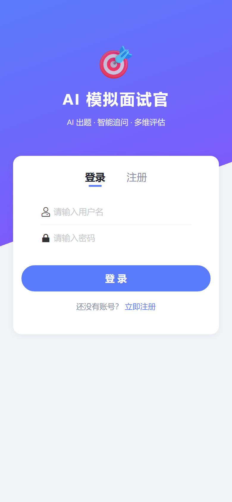
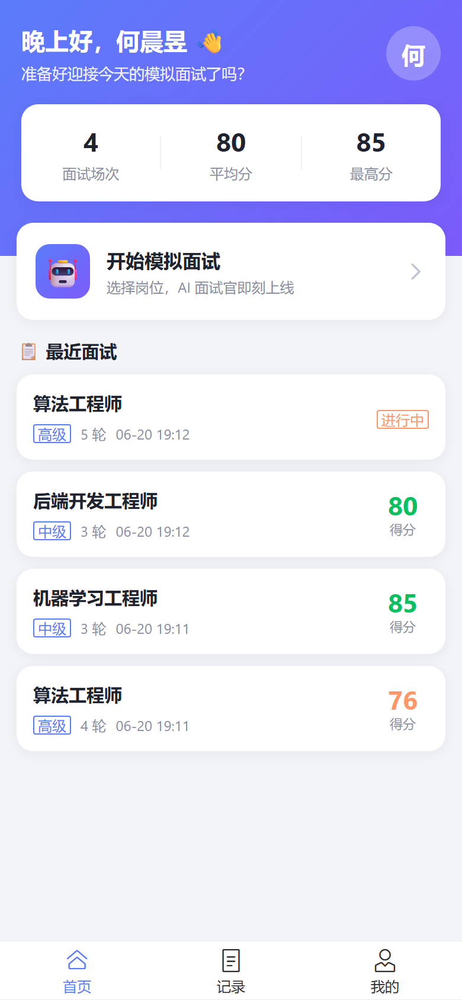
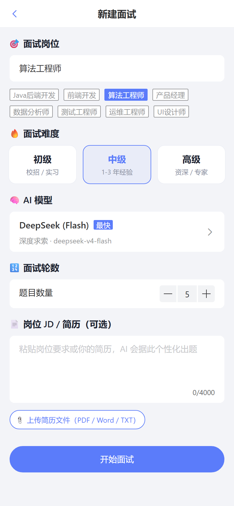
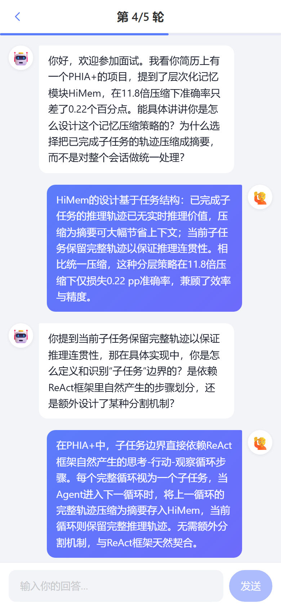
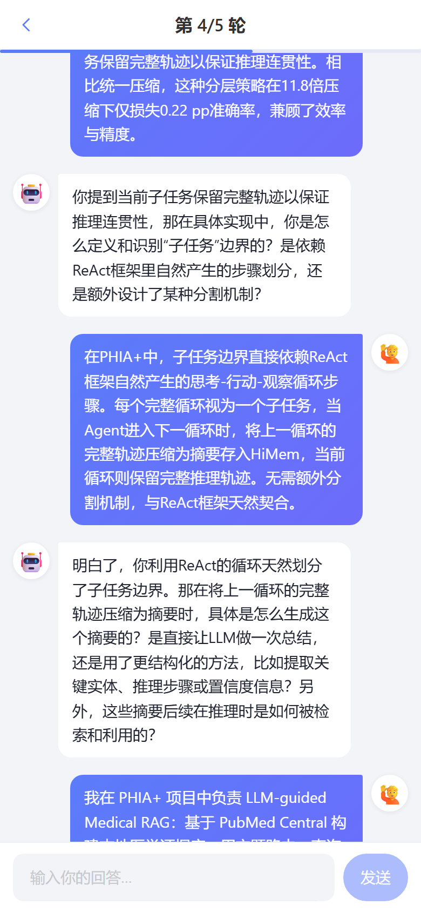
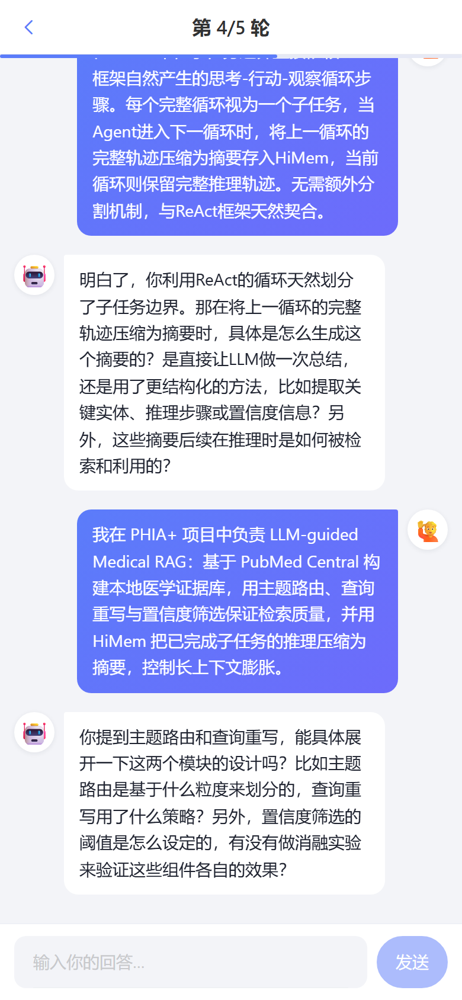
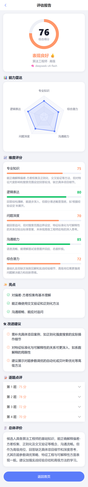
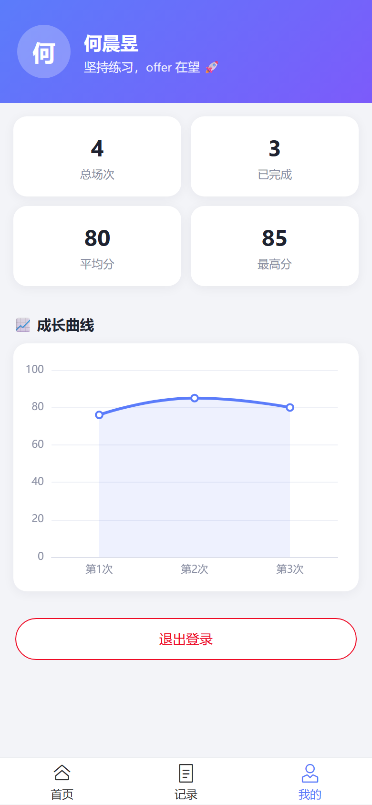
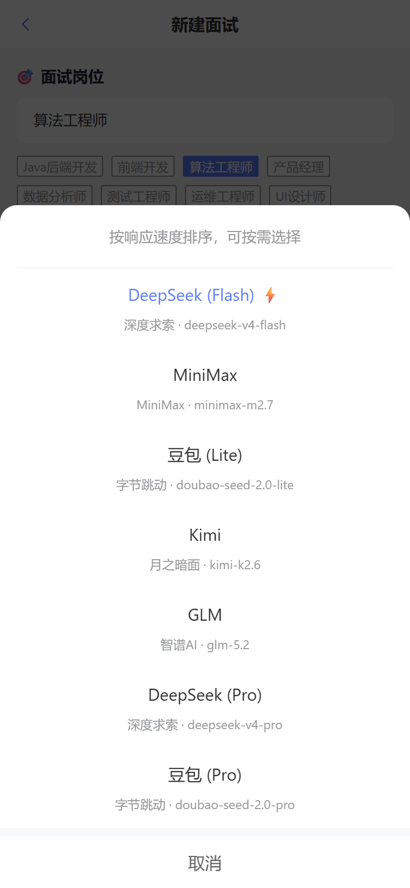

# AI 模拟面试官（AI Mock Interview）

> 一款以**大模型**为核心的移动端模拟面试应用：选择岗位后，AI 面试官会逐轮提问并**根据回答智能追问**，面试结束后给出**多维度能力评估、雷达图、逐题点评与改进建议**，并以**成长曲线**记录每一次进步。

本项目为《移动终端程序设计》结课作业，采用 **H5 / 混合开发**：`Vue 3` 前端 + `Node.js(Express)` 后端 + `SQLite` 数据库 + 大模型 API，并通过 `Capacitor` 可打包为 Android 应用。

---

## ✨ 功能特性

| 模块 | 说明 |
| --- | --- |
| 👤 用户系统 | 注册 / 登录，密码 `bcrypt` 加密入库，`JWT` 维持登录态 |
| 🎯 创建面试 | 选择岗位方向、难度（初/中/高级）、轮数，可粘贴 JD/简历让 AI **个性化出题** |
| 🧠 多模型可选 | 新建面试时可选择 7 个大模型（DeepSeek/MiniMax/豆包/Kimi/GLM…），按响应速度排序 |
| 📎 简历文件解析 | 上传 **PDF / Word(.docx) / TXT** 简历，服务端自动提取文本，让 AI 据此个性化出题 |
| 💬 多轮对话面试 | AI 面试官逐题提问，并结合上一轮回答进行**自然追问**，沉浸式聊天体验 |
| 📊 多维智能评估 | 面试结束后大模型从**专业知识 / 逻辑表达 / 问题深度 / 沟通能力 / 综合潜力**五个维度打分 |
| 📈 可视化报告 | 能力**雷达图**、维度评分条、逐题点评、亮点与改进建议、总体评价 |
| 🗂️ 历史记录 | 所有面试持久化存储，可回看、可删除 |
| 🚀 成长曲线 | "我的"页用折线图展示历次面试总分趋势，量化进步 |

## 🛠️ 技术栈

- **前端**：Vue 3 + Vite + Vue Router + Pinia + [Vant](https://vant-ui.github.io/vant/)（移动端 UI）+ [ECharts](https://echarts.apache.org/)（雷达图/折线图）
- **后端**：Node.js + Express + JWT
- **数据库**：SQLite（基于 Node.js 24 内置的 `node:sqlite`，零原生依赖）
- **AI 大模型**：OpenAI 兼容协议接入，**火山方舟（主）+ 阿里云百炼（备）双厂商自动故障转移**，支持 7 个模型按需切换
- **简历解析**：multer（上传）+ pdf-parse / mammoth（PDF、Word 文本提取）
- **混合打包**：Capacitor（可构建为 Android APK）

## 🏗️ 系统架构

```
┌─────────────────────────┐     HTTP/JSON      ┌──────────────────────────┐
│   前端 (Vue3 + Vant)     │  ───────────────▶  │   后端 (Express + JWT)    │
│  H5 / Capacitor 混合 App │  ◀───────────────  │                          │
└─────────────────────────┘                    └───────────┬──────────────┘
                                                            │
                                       ┌────────────────────┼────────────────────┐
                                       ▼                                         ▼
                            ┌────────────────────┐                  ┌─────────────────────────┐
                            │  SQLite 数据持久化   │                  │  大模型 API（OpenAI 兼容） │
                            │ users/interviews/   │                  │  火山方舟(主) → 百炼(备)   │
                            │ messages            │                  │  出题 / 追问 / 评估        │
                            └────────────────────┘                  └─────────────────────────┘
```

## 📁 目录结构

```
MyProj/
├── server/                    # 后端服务
│   ├── src/
│   │   ├── index.js           # 服务入口
│   │   ├── db.js              # 数据库连接与建表（node:sqlite）
│   │   ├── llm.js             # 大模型调用（主备故障转移 + 评估归一化）
│   │   ├── models.js          # 可选模型白名单（前后端单一数据源）
│   │   ├── middleware/auth.js # JWT 鉴权中间件
│   │   └── routes/            # auth / interviews / stats / resume 路由
│   ├── .env.example           # 环境变量模板（复制为 .env 填入 key）
│   └── package.json
├── client/                    # 前端应用
│   ├── src/
│   │   ├── views/             # Login/Home/NewInterview/Session/Result/History/Profile
│   │   ├── components/        # InterviewItem / EChart
│   │   ├── store/auth.js      # Pinia 登录态
│   │   ├── api/index.js       # axios 封装
│   │   └── router/            # 路由 + 登录守卫
│   ├── android/               # Capacitor 生成的 Android 工程（混合打包）
│   └── package.json
└── docs/screenshots/          # 运行截图
```

## 🗃️ 数据库设计

| 表 | 关键字段 | 说明 |
| --- | --- | --- |
| `users` | id, username(唯一), password_hash | 用户 |
| `interviews` | id, user_id, position, difficulty, total_rounds, jd_text, status, current_round, total_score, evaluation_json | 一场面试 |
| `messages` | id, interview_id, role(interviewer/candidate), content, round_no | 面试问答记录 |

## 🚀 本地运行

> 前置：Node.js ≥ 22（推荐 24，内置 `node:sqlite`）。

### 1. 配置后端环境变量（**必做**，不能只跑 install + start）

> ⚠️ 这一步**必须先做**：要新建并编辑 `server/.env` 文件填入大模型 API Key。
> 否则注册/登录虽可用，但 **AI 出题与评估会因缺少 Key 而报错**。

```bash
cd server
cp .env.example .env        # Windows：copy .env.example .env
```

然后用编辑器打开 `server/.env`，**至少填入一个厂商的 API Key**（火山方舟或百炼，留空的会被自动跳过），并把 `JWT_SECRET` 改成任意随机串：

```ini
LLM_PRIMARY_API_KEY=你的火山方舟_API_Key
LLM_FALLBACK_API_KEY=你的百炼_API_Key
JWT_SECRET=任意一段随机字符串
```

### 2. 启动后端（默认 http://localhost:3001）

```bash
cd server
npm install
npm start
```

### 3. 启动前端（默认 http://localhost:5173）

```bash
cd client
npm install
npm run dev
```

浏览器以**移动端视口**打开 `http://localhost:5173` 即可体验。

## 📱 打包为 Android（混合开发）

```bash
cd client
npm run build          # 构建前端产物到 dist
npx cap sync android   # 同步到 Android 工程
npx cap open android   # 用 Android Studio 打开并构建 APK
```

## 🔌 后端接口

| 方法 | 路径 | 说明 |
| --- | --- | --- |
| POST | `/api/auth/register` | 注册 |
| POST | `/api/auth/login` | 登录 |
| GET | `/api/models` | 可选大模型清单 |
| POST | `/api/resume/parse` | 上传并解析简历文件（PDF/Word/TXT） |
| POST | `/api/interviews` | 创建面试并生成第一题 |
| GET | `/api/interviews` | 面试列表 |
| GET | `/api/interviews/:id` | 面试详情（含对话与评估） |
| POST | `/api/interviews/:id/answer` | 提交回答，返回下一题 |
| POST | `/api/interviews/:id/finish` | 结束并生成评估报告 |
| DELETE | `/api/interviews/:id` | 删除面试 |
| GET | `/api/stats` | 统计与成长曲线数据 |

## 🖼️ 运行截图

| 登录 | 首页 | 新建面试 |
| :---: | :---: | :---: |
|  |  |  |

| 多轮面试 | 评估报告 | 成长曲线 |
| :---: | :---: | :---: |
| <br><br> |  |  |

> 多模型选择（按响应速度排序，含厂商与全名）：
>
> 

## 🔒 关于密钥安全

`.env` 已被 `.gitignore` 忽略，**不会提交**真实 API Key；仓库仅保留 `.env.example` 模板。

---

> 东北大学秦皇岛分校 · 计算机与通信工程学院 ·《移动终端程序设计》结课作业
